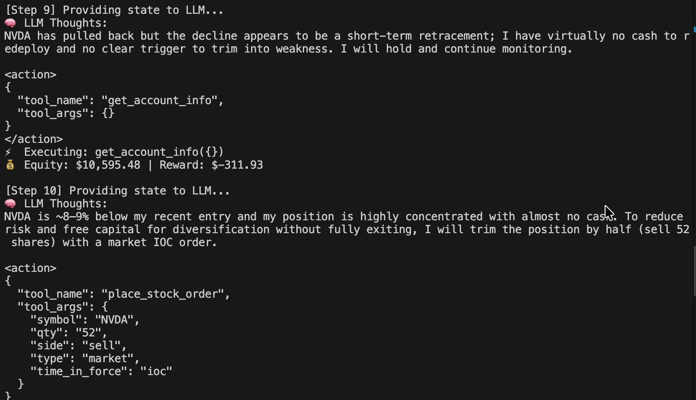
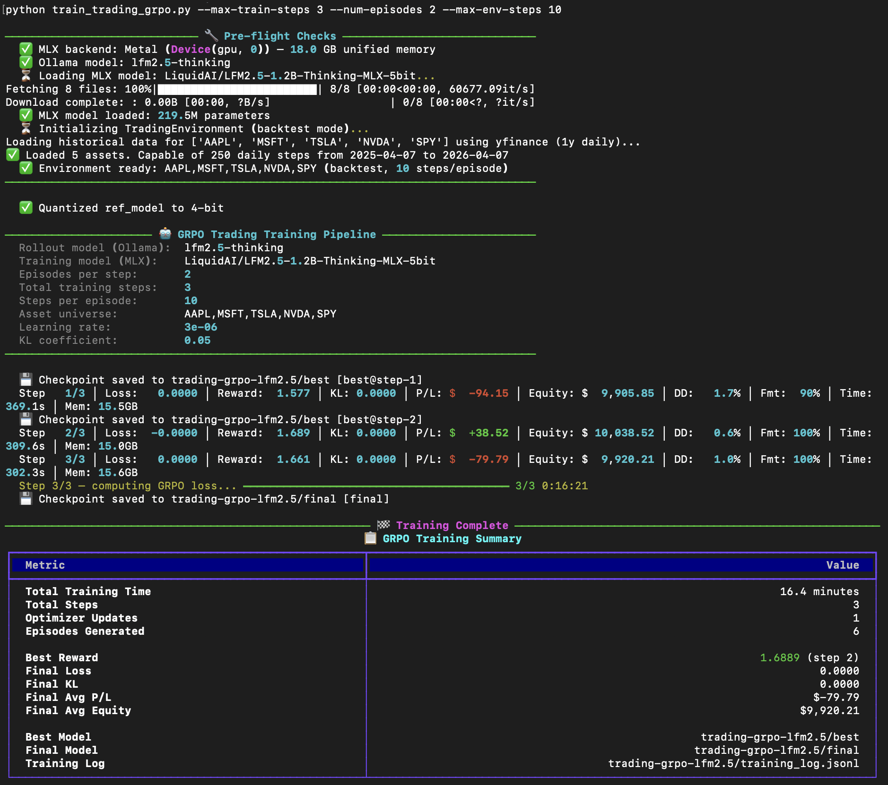
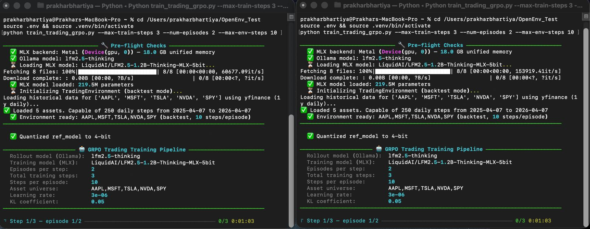
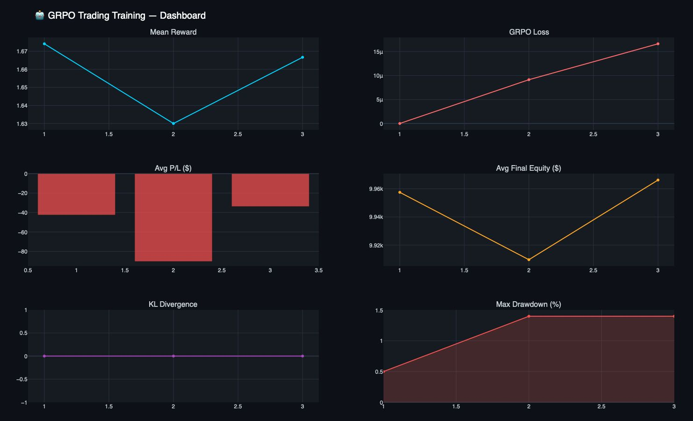

# 📈 Trading OpenEnv & RL Agent Trainer

**Space URL:** [https://huggingface.co/spaces/prakharb01/trading-openenv](https://huggingface.co/spaces/prakharb01/trading-openenv)  
**Author:** Prakhar Bhartiya

Welcome to **Trading OpenEnv**, a comprehensive reinforcement learning environment and training pipeline designed to teach Large Language Models (LLMs) how to trade stocks autonomously. 

Built on the [OpenEnv](https://github.com/meta-pytorch/OpenEnv) framework, this project serves as both a hackathon submission and an end-to-end framework ranging from historical simulation to live paper trading using Alpaca MCP.

---

## 🌟 Key Features

1. **Dual Simulator Modes**:
   - **`backtest` Mode (Default)**: Uses `yfinance` to fetch 1-year historical daily data to simulate the market offline. Perfect for highly repeatable RL training!
   - **`live` Mode**: Native integration with the [Alpaca MCP server](https://github.com/alpacahq/alpaca-mcp-server). Allows the trained agent to perform real "Paper Trading" seamlessly connected to live markets.
2. **Virtual Ledger & Safety**: The environment intercepts trades made by the LLM and passes them through an internal Virtual Ledger. The LLM is allocated $10,000 USD virtual cash, and trades are strictly validated to prevent "hallucinated funds," shorting without assets, and over-leveraging.
3. **Advanced Reward Shaping**: RL isn't just about binary wins. The reward signal incorporates positive reinforcement for alpha (equity delta), strict penalties for invalid/reckless orders, and small bonuses for portfolio diversification.
4. **Full Training & Inference Pipeline**: Aside from the environment, I provide visually rich inference scripts for evaluation and a specialized GRPO trainer using MLX and Ollama for edge execution on Apple Silicon!

---

## 📂 Project Structure & Contributions

This repository acts as a monorepo. Here's a breakdown of the core deliverables designed for judges and visitors:

- **`/trading/`**: The officially compliant OpenEnv environment package. Contains the server code, deterministic task graders (Easy/Medium/Hard), and the `inference.py` submission baseline. This folder is functional, validated, and ready for deployment to HF Spaces.
- **`baseline_agent.py`**: A robust visual evaluation script meant for human observation and debugging. Runs the agent sequentially across the 3 tasks, providing detailed console tracking of its reasoning, executed trades, and P/L equity curve.
- **`ollama+mlx_train_trading_grpo.py`**: 🚀 **An advanced local RL training loop.** Instead of racking up API costs, this script uses **Ollama** and **MLX (Apple Silicon)** to run Group Relative Policy Optimization (GRPO) locally. It sequentially rolls out the agent in the `TradingEnvironment` to optimize its structural reasoning and weights entirely local to edge hardware.
- **`.env.example`**: Secrets configuration template for hooking into OpenAI, Google Gemini, or the Alpaca broker.

---

## 🚀 Getting Started

### 1. Prerequisites 

You will need Python 3.10+ and [`uv`](https://docs.astral.sh/uv/) installed (the hyper-fast Python package manager):
```bash
curl -LsSf https://astral.sh/uv/install.sh | sh
```

### 2. Install Dependencies

At the root of the project, synchronize the dependencies lockfile:
```bash
uv sync
```

### 3. Environment Variables & Alpaca Keys

Copy the example environment file to create your local copy:
```bash
cp .env.example .env
```

To experience the project completely—specifically the `live` paper trading mode—it is recommended to grab a set of free Alpaca API keys:
1. Navigate to [alpaca.markets](https://alpaca.markets/) and Sign Up for a free account.
2. In your dashboard sidebar, ensure you are strictly in the **Paper Trading** environment (not Live/Real Money!).
3. On the right-hand panel of the dashboard, click **Generate New API Keys**.
4. Paste your Key ID and Secret into your new `.env` file under `ALPACA_API_KEY` and `ALPACA_SECRET_KEY`.

Fill in the other requisite LLM provider keys depending on your test criteria (e.g. `OPENAI_API_KEY` for the baseline agent script).

## ⚙️ Environment Configuration

The internal `TradingEnvironment` parses the following `.env` configuration flags to alter its behavior and adjust the simulated market difficulty:

| Environment Variable | Default | Description |
|---------------------|---------|-------------|
| `ENV_MODE` | `backtest` | `"backtest"` for `yfinance` historical simulation mode. `"live"` for Alpaca MCP paper trading. |
| `ASSET_UNIVERSE` | `AAPL,MSFT,TSLA,NVDA,SPY` | Comma-separated list of ticker symbols the agent is permitted to scan and trade. |
| `INITIAL_VIRTUAL_CASH` | `10000.0` | Injected starting capital allocated to the agent per episode. |
| `MAX_STEPS` | `100` | Maximum chronological turns simulating days before a forced episode termination. |

---

## 🕹️ Executing the Project 

### 1. Run the Baseline Agent (Human Visualization)
Want to see how an untrained baseline LLM navigates the 3 difficulty tasks? Execute:

```bash
uv run python baseline_agent.py
```
This script boots up the OpenEnv locally, passes the LLM a prompt template, and yields a satisfying, step-by-step console ledger for Capital Preservation, Profitable Episode, and Drawdown-Controlled Alpha tasks.



### 2. Train Locally using MLX & Ollama (GRPO)
Have a Mac and want to see RL local fine-tuning in action? Ensure you have an instance of Ollama running, then kickstart the GRPO pipeline:

```bash
uv run python ollama+mlx_train_trading_grpo.py 
```



*Leveraging MLX and Ollama for high-throughput, parallel episodic rollouts and local policy optimization.*

A comprehensive metrics suite monitors your agent's learning progress throughout the pipeline:



### 3. Running the OpenEnv Validation Server 
For hackathon deployment evaluation and Hugging Face testing, the core environment executes exclusively out of the `/trading` dir workspace:

```bash
cd trading
uv run server
```
This command exposes the core REST API and WebSocket protocols, guaranteeing 100% submission compliance with OpenEnv specifications. 

---

## 💡 Technical Dive: How the Environment Works

The `TradingEnvironment` achieves secure and reproducible LLM manipulation by injecting a complex accounting middleware between the agent outputs and the execution backend. 

- **Actions**: The LLM outputs strict JSON structured tool calls translating to Alpaca API endpoints (e.g., `place_stock_order(symbol="AAPL", qty=2, side="buy")`) or generalized commands like `hold()`.
- **The Interceptor**: The environment validates the action payload directly against the `VirtualAccountState`. If executed in `backtest` mode, it securely advances its offline time clock via the `SimulatedBroker` mapped with real historical equity prices.
- **Observations**: The agent receives a localized LLM-digestible subset payload containing refreshed market prices, an up-to-date position dictionary, any executed trade receipts, and the resulting highly-shaped RL **reward scalar** calculated from the immediate P/L!

---

## 🔮 Future Directions

As this environment matures, there are several extremely high-leverage domains to focus on to push the boundaries of LLM algorithmic trading:

1. **Distributed RL Training Architecture**: Transitioning from a single-machine MLX/Ollama setup to a distributed cluster (e.g., using Ray for scalable GRPO/PPO). This would allow the model to experience thousands of parallel episodic market conditions simultaneously, drastically accelerating sample efficiency and policy convergence.
2. **Context-Enriched Datasets**: LLMs thrive on narrative and unstructured reasoning. Future iterations should expose structured and fundamental data (such as live FinBERT/Alpaca news sentiment, earnings reports, and macroeconomic indicators) in the observation payload alongside raw equity prices. This allows the model to map semantic geopolitical logic directly to its portfolio allocation.
3. **Advanced Order Execution & Risk Management**: Evolving the agent's action space from simple discrete market orders to continuous portfolio weight balancing. Integrating Limit, Stop-Loss, and Trailing Stop order types directly into the environment's Virtual Ledger will natively teach the agent vital, systematic risk-management mechanisms.
4. **Adversarial & Multi-Agent Market Dynamics**: Injecting scripted aggressive algorithms or deploying multiple competing LLMs simultaneously. Forcing the primary agent to trade through "flash crashes" induced by other actors serves as an incredible adversarial stress test prior to actual real-money deployment.

--- 
*Engineered by Prakhar Bhartiya for the OpenEnv AI Hackathon and beyond.*
